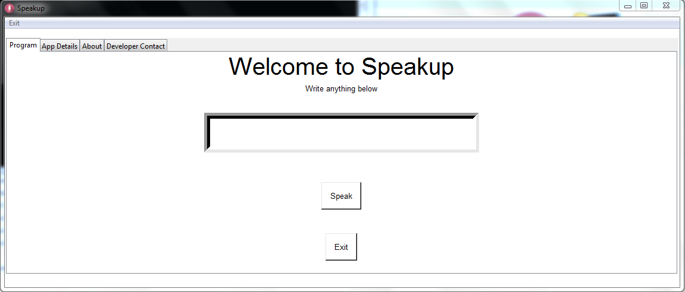
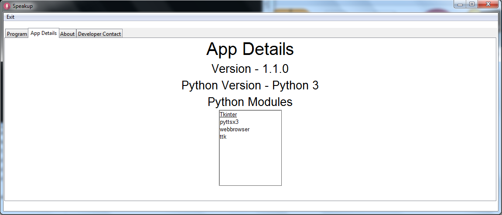

# Speakup

Speakup is a text-to-speech program, which can convert the text typed in the entry box into speech. A bot has been made that will narrate anything written in the textbox. It has been made in Python Tkinter. The program has been released, but it is currently under development. It is in beta version. More updates will come up soon.

# Installation
The program has not been converted to exe due to errors, the program uses voice module and thus after converting it to exe the code breaked. 

Install the program by downloading the zip file or use the git clone command in your terminal like this
https://github.com/kavinjindal/Speakup.git

# Dependencies
You will need the following Python dependencies installed to run the program.

* tkinter
* pyttsx3
* ttk

# Python Version Support

Python3 version support is needed. Make sure to have it on your pc.

# Python Modules used:
Below are the modules used for coding the program:
* ttk
* pyttsx3 (for speech bot)
* tkinter

# Screenshots

# Features
* The program will speak up everything typed in the textbox. 

# Updates
The program is under beta version and testing also, its early access app will come on 27th July.
* Updates listed below will come up in the next versions of Speakup
* New customizing feature is being worked on
* Voice changing
* Talking speed changing
* Better GUI
* Menus

# Report issues and bugs
You can email your queries and issues here
kavinsjindal@gmail.com
- > You can even use this link to report issues
https://github.com/kavinjindal/Speakup/issues
* Please tell us if you have any problem so that we can improve our programs.

